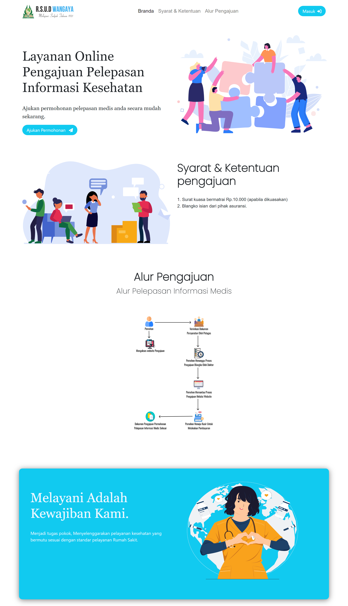
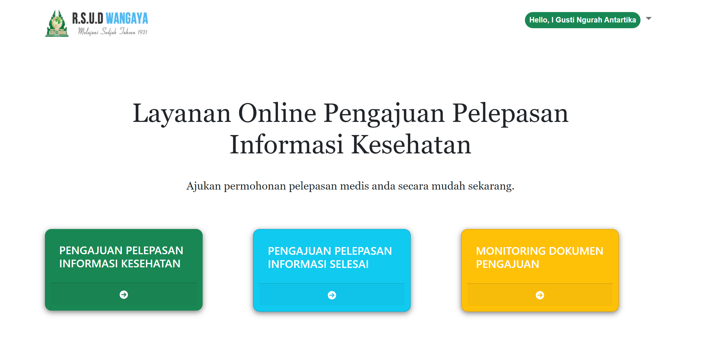
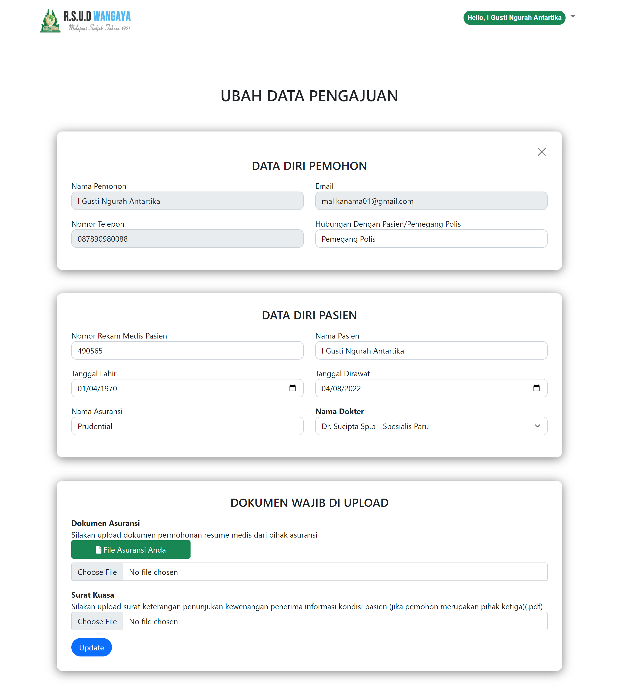
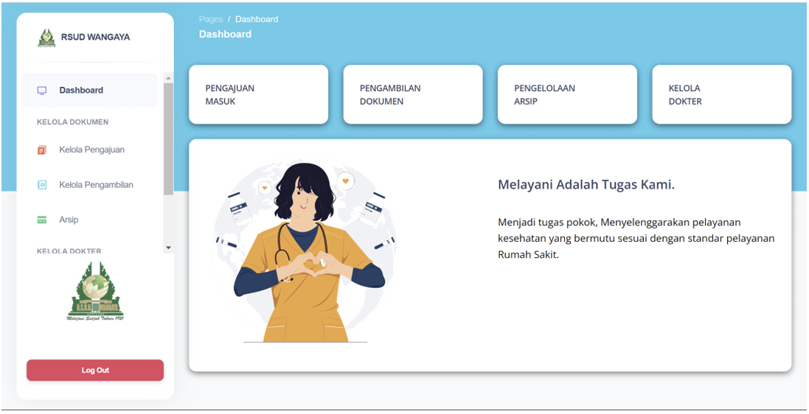
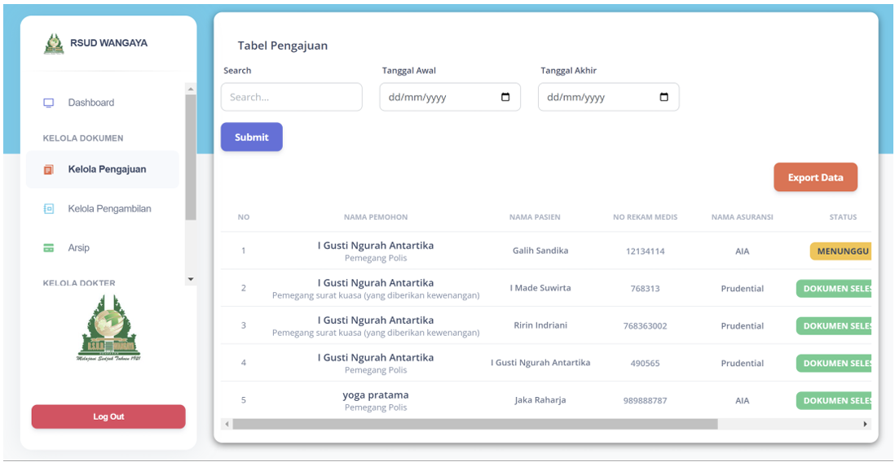

# 🏥 Medical Certificate Service Information System
### RSUD Wangaya Denpasar City


> A web-based information system for digitizing the medical certificate request process at the Medical Records Installation of RSUD Wangaya, Denpasar City. Built as a Final Year Project for the D3 Informatics Management Program in 2022.

---

## 📋 Background

The medical certificate service at RSUD Wangaya was previously handled entirely manually — applicants had to visit the counter in person, and staff used manual control books to track submissions. This system was built to digitize the entire process, making it more efficient, transparent, and monitorable in real-time.

---

## 📸 Screenshots


### Landing Page

The main page of the application, displaying service information and login buttons for both applicants and staff.

### Applicant Dashboard

The dashboard view after an applicant successfully logs in, showing a summary of ongoing medical certificate submission statuses.

### Submission Request Form

The form page for submitting a medical certificate request, including applicant details, the type of certificate needed, and required document uploads.

### Staff Dashboard

The dedicated dashboard for medical records staff, displaying a summary of incoming submissions that require action.

### Manage Submissions

The submission management page for staff, equipped with search functionality, date range filters, and *accept*, *recheck*, or *decline* actions for each submission.

---

## ✨ Features

### Applicant
- 📝 **Registration & Login** — authentication for applicants
- 📄 **Submit Request** — submit a medical certificate request online (insurance, death certificate, birth certificate, visum, etc.)
- 📡 **Track Submission** — monitor submission status in real-time
- 🗂️ **Submission History** — view the history of all previous submissions
- 👤 **Profile Management** — update and manage personal information

### Staff
- ✅ **Manage Submissions** — review submissions with *accept*, *recheck*, or *decline* actions along with comments
- 📦 **Manage Pickups** — handle the document pickup process for applicants
- 🗄️ **Manage Archives** — manage archived medical certificate documents
- 👨‍⚕️ **Manage Doctors** — manage doctor data
- 🔬 **Manage Specializations** — manage doctor specialization data
- 📊 **Export Data** — export data to Excel based on a date range

---

## 👥 Actors / Users

| Actor | Description |
|-------|-------------|
| **Staff** | Medical records staff responsible for the release of medical information at RSUD Wangaya. Manages all hospital-side processes. |
| **Applicant** | Patient or third party (family member, insurance provider, court) who submits a medical certificate request online. |
| **Doctor** | Doctor responsible for filling in patient condition data as required by insurance providers. |

---

## 🛠️ Tech Stack

| Category | Technology |
|----------|------------|
| Backend | PHP, Laravel |
| Frontend | Bootstrap, Blade Template |
| Database | MySQL |
| Development Method | Waterfall |

---

## ⚙️ Installation & Setup

### Prerequisites
- PHP >= 7.4
- Composer
- MySQL
- Node.js & NPM

### Steps

```bash
# 1. Clone the repository
git clone https://github.com/prayoga01/sistem-informasi-medis.git
cd sistem-informasi-medis

# 2. Install PHP dependencies
composer install

# 3. Install frontend dependencies
npm install && npm run dev

# 4. Copy the environment file
cp .env.example .env

# 5. Generate app key
php artisan key:generate

# 6. Configure the database in .env
DB_DATABASE=your_database_name
DB_USERNAME=your_username
DB_PASSWORD=your_password

# 7. Run migrations & seeders
php artisan migrate --seed

# 8. Start the development server
php artisan serve
```

Access the app at `http://localhost:8000`

---

## 👨‍💻 Author

**Yoga Pratama**
- GitHub: [@prayoga01](https://github.com/prayoga01)

---

## 📝 License

This project was created for academic purposes — D3 Final Year Project — Bali State Polytechnic, 2022.
